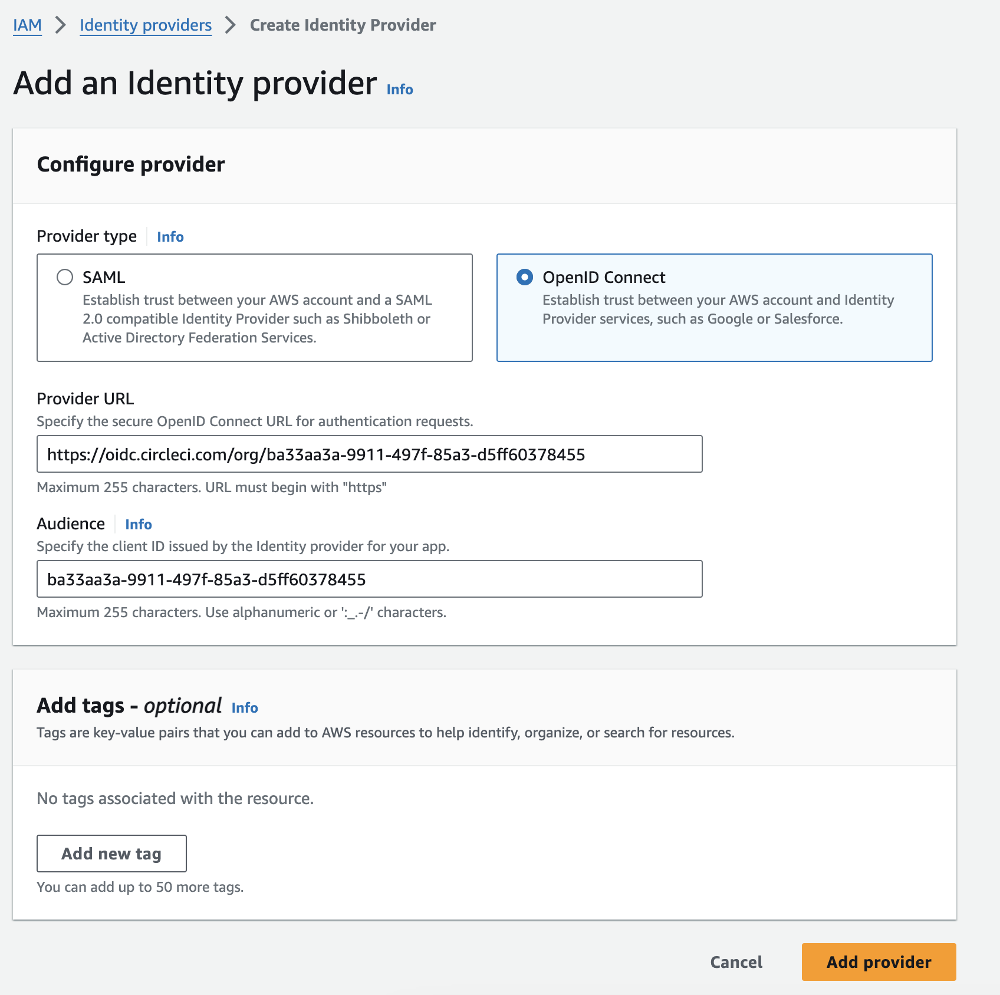

[YouTube video](https://youtu.be/TQigM50RFnw)


This guide will walk you through the process of setting up an OIDC Provider in AWS IAM for CircleCI using Terraform.

## Prerequisites

- AWS Account with necessary permissions.
- CircleCI account.
- Terraform installed on your local machine.

## Steps

### 1. Obtain CircleCI Organization ID

To set up an OIDC Provider, you need your CircleCI Organization ID. Follow these steps to obtain it:

1. Log in to your CircleCI account.
2. Navigate to the Organization Settings.
3. Look for the organization ID in the URL or in the settings.

For more detailed instructions, watch this [YouTube video](https://youtu.be/TQigM50RFnw).


### 3. Add AWS Oidic Provider 
1. Navigate to : [Identity providers](
https://us-east-1.console.aws.amazon.com/iam/home?region=ap-south-1#/identity_providers)

2. Click on add Provider Button

3. Provider URL: https://oidc.circleci.com/org/${YOUR ORGANIZATION ID}

4. Audience : ${YOUR ORGANIZATION ID}

4. Click on Add provider button 



### 4. Create Role 
Create Role with "Custom trust policy"

your Trust policy will be 
```
{
    "Version": "2012-10-17",
    "Statement": [
        {
            "Effect": "Allow",
            "Principal": {
                "Federated": "arn:aws:iam::${account id}:oidc-provider/oidc.circleci.com/org/${YOUR ORGANIZATION ID}"
            },
            "Action": "sts:AssumeRoleWithWebIdentity",
            "Condition": {
                "StringLike": {
                    "oidc.circleci.com/org/${YOUR ORGANIZATION ID}:sub": "org/${YOUR ORGANIZATION ID}/project/${Project ID}/user/*"
                }
            }
        }
    ]
}
```

For more detailed instructions, watch this [YouTube video](https://youtu.be/TQigM50RFnw).
